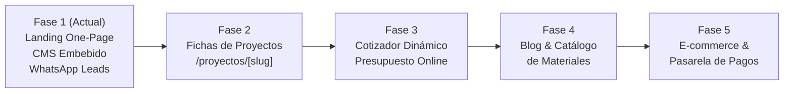

# Arquitectura Técnica y Hoja de Ruta de Escalabilidad: Filippo Cocinas

Este documento explica las decisiones de diseño arquitectónico tomadas para la landing page de **Filippo Cocinas** y detalla la hoja de ruta técnica para hacer crecer el sitio en futuras etapas comerciales sin necesidad de rehacer el código.

---

## 1. Principios de Arquitectura

Para evitar que una landing page requiera una reescritura total cuando la empresa crezca, implementamos cuatro pilares:

### 1.1 Separación Estricta de Capas (Contenido, Estilos y Lógica)
- **Capa de Contenido:** Almacenada en `src/data/siteContent.json`. Ningún texto comercial, número de WhatsApp o proyecto está incrustado rígidamente dentro de las etiquetas HTML de los componentes.
- **Capa de Identidad Visual (Design Tokens):** Centralizada en `src/styles/design-tokens.css` y consumida por `tailwind.config.mjs`. Cambiar los colores de la marca, los márgenes o las fuentes toma menos de un minuto.
- **Capa de Lógica y Componentes:** Componentes `.astro` independientes en `src/components/sections/` y utilidades funcionales en `src/utils/`.

### 1.2 Modularidad de Componentes
Cada sección (`Hero`, `Services`, `Gallery`, `Process`, `Testimonials`, `Faq`, `ContactForm`) es un bloque autocontenido.
- Quitar una sección no rompe ninguna otra.
- Reordenar la landing page se logra simplemente cambiando el orden de las etiquetas en `src/pages/index.astro`.

### 1.3 Sistema de Rutas Preparado para Páginas Internas
Astro utiliza enrutamiento basado en archivos (`file-based routing`). Esto significa que crear una nueva sección o página a futuro no requiere configurar enrutadores complejos ni routers de cliente.

---

## 2. Hoja de Ruta de Escalabilidad Paso a Paso



### Fase 1: Estado Actual (Landing One-Page + CMS + WhatsApp Leads)
- **Entregado:** Landing page de alta conversión para adquisición de clientes.
- **Canal de cierre:** WhatsApp estructurado con mensajes dinámicos contextuales.
- **Gestión:** Panel `/admin` con autenticación, edición de textos y subida optimizada de imágenes a WebP.

---

### Fase 2: Páginas Internas por Proyecto (`/proyectos/[slug]`)
**Objetivo:** Permitir que cada cocina de la galería tenga una URL dedicada con galería fotográfica completa de 8-10 tomas, plano de distribución arquitectónica y ficha técnica de herrajes.

**Cómo implementarlo sin rehacer el código:**
1. Crear el archivo `src/pages/proyectos/[id].astro`.
2. En `siteContent.json`, agregar el campo `"slug"` y un array `"galleryImages": []` dentro de cada proyecto.
3. Astro generará automáticamente las páginas dinámicas con `getStaticPaths` o mediante SSR:
   ```astro
   ---
   // src/pages/proyectos/[id].astro
   import Layout from '../../layouts/Layout.astro';
   import siteContent from '../../data/siteContent.json';
   
   const { id } = Astro.params;
   const project = siteContent.gallery.projects.find(p => p.id === id);
   ---
   <Layout title={`${project.title} | Filippo Cocinas`}>
     <!-- Renderizado de la ficha detallada -->
   </Layout>
   ```

---

### Fase 3: Cotizador Interactivo de Cocinas
**Objetivo:** Permitir que el cliente seleccione la forma de su cocina (en L, con isla, lineal), los metros lineales aproximados y el tipo de cubierta (cuarzo, travertino, sinterizado) para obtener un rango presupuestal estimado antes de enviar la solicitud a WhatsApp.

**Cómo implementarlo sin rehacer el código:**
1. Crear el componente `src/components/interactive/KitchenCalculator.astro` (o una pequeña isla interactiva en React, Vue o Svelte).
2. Conectar la salida del cálculo a la función `buildWhatsAppUrl` ya existente:
   ```typescript
   const msg = `Hola Filippo, calculé mi cocina en el cotizador web: Forma ${forma}, ${metros}m, acabado ${material}. Rango estimado: $${min}-$${max}. Quisiera agendar visita técnica.`;
   window.open(getWhatsAppUrl(msg), '_blank');
   ```

---

### Fase 4: Catálogo de Materiales y Blog de Tendencias
**Objetivo:** Posicionamiento orgánico en Google (SEO de contenidos) para términos como *"Cocinas en mármol travertino vs cuarzo"* o *"Herrajes Blum cierre suave"*.

**Cómo implementarlo sin rehacer el código:**
1. Habilitar la carpeta `src/content/blog/` con archivos Markdown o MDX aprovechando las *Content Collections* nativas de Astro.
2. Crear la plantilla `src/pages/blog/[...slug].astro`.
3. El panel `/admin` puede extenderse agregando una pestaña para crear artículos Markdown con el mismo endpoint `/api/admin/content`.

---

### Fase 5: Tienda de Accesorios / E-Commerce y Pasarela de Pagos
**Objetivo:** Venta directa de accesorios de cocina de alta gama (tablas de madera noble, cuberteros de roble a medida, kits de mantenimiento de piedra, griferías seleccionadas).

**Cómo implementarlo sin rehacer el código:**
1. Crear la ruta `/tienda` o `/accesorios`.
2. Integrar pasarelas populares como **Stripe**, **Mercado Pago** o **Wompi** mediante endpoints en `src/pages/api/checkout.ts`.
3. Los estilos, tokens y layout base de Filippo se heredan automáticamente sin duplicar código.

---

## 3. Conclusión de Mantenibilidad

El proyecto ha sido concebido para que:
1. **Un cliente sin experiencia técnica** pueda operar y actualizar su sitio web diariamente desde `/admin`.
2. **Cualquier desarrollador front-end junior o senior** pueda comprender la arquitectura en menos de 10 minutos gracias a los comentarios exhaustivos, la tipificación clara en TypeScript y la estructura modular limpia.
